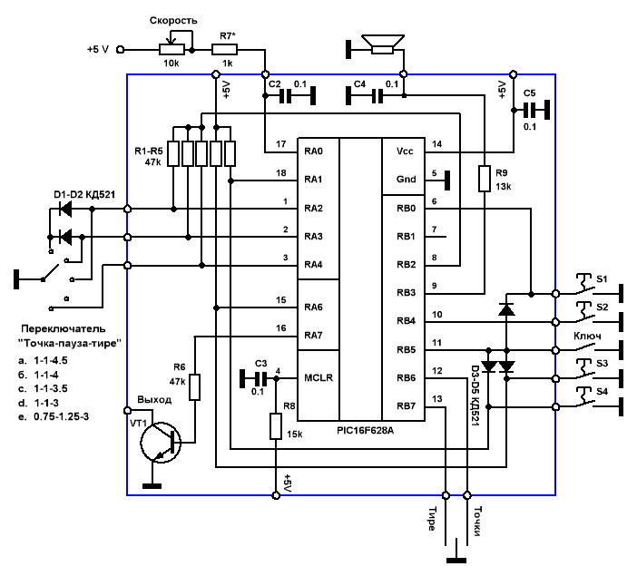

Клюихин А. RU3GA

# Ямбический ключ с памятью

Ключ собран на контроллере PIC16F628A. В качестве задающего опорного генератора использован встроенный прецезионный генератор на 4 Мгц. Напряжение питания 2.0 - 5.5 В. Проверено , что схема сохраняет работоспособность вплоть до 1.2 В , но для гарантированной работы все таки нужно не меньше 2 В.

Ток потребления :

- в рабочем режиме --- 2-4 мА (Uпит=5 В), 0.5-0.8 мА (Uпит=3 В)
- в дежурном режиме --- менее 1 мкА (по паспорту контроллера --- 100 нА).

Таким образом схему можно питать от простой литиевой батарейки на 3-3.6 В , которой должно хватить на пару лет без всяких выключений питания.

## Функции

- Ямбический режим с памятью элемента знака
- 4 ячейки памяти по 30 букв каждая.
- Запись в ячейки памяти с помощью манипулятора. Ресурс перезаписи ячеек ---1.000.000 раз.
- Возможность исправления по ходу записи в ячейку.
- Информация в ячейках сохраняется при выключении питания.
- Регулировка скорости --- переменным резистором --- от 4 WPM до 100WPM.
- Тон самопрослушивания --- 800Гц.
- Включение\выключение самопрослушивания с помощью кнопок.
- Возможность подключения простого ключа типа «клоподав»
- Регулировки соотношений «точка-пауза-тире» --- с помощью переключателя :
    - 0.75-1.25-3
    - 1-1-3
    - 1-1-3.5
    - 1-1-4
    - 1-1-4.5
- Реверс манипулятора с помощью кнопок.
- Режим «настройка РА» --- включение\выключение с помощью кнопок.

## Работа с ключом

- **Запись в ячейку памяти**

    Нажимаем на нужную кнопку памяти и удерживаем её в течение 2 сек. Устройство передаст " WR " и перейдет в режим ожидания ввода буквы. При записи ---паузы  между буквами распознаются автоматически. Для установки паузы между словами нужно сделать паузу в передаче на 2 сек , при этом ключ передаст " R "--- это   значит , что он понял раздел между словами и переходит в режим ожидания дальнейшего ввода. Он ждет , пока вы не начнете вводить следующее слово.Так что в    паузах между словами можно сходить выпить кофе и потом с новыми силами продолжить запись. За три буквы до окончания памяти ячейки тонпередачи меняется ---    это сигнал к тому , что пора заканчивать запись. Окончание записи --- нажатие на любую кнопку.

- **Исправления ошибок при записи**

    Если был введен ошибочный символ , то даем серию точек больше шести. Ключ передаст « R » , это обозначает , что он перешел в режим коррекции , далее он передает « LAST »+« оследнюю правильно введенную букву » и переходит в режим ожидания ввода текста. Если ошибка была на первой букве , то ключ передаст « LAST NO ».
    - **Пример**: надо ввести в память « CQ DE RU3GA » . При вводе получилось « CQ DI »… Даем серию точек и ждем , ключ передает « R », затем « LAST D » и переходит в режим ожидания --- вводим дальше « E RU3GA » и нажимаем на любую кнопку для выхода из режима записи.
Можно править не только последнюю букву, но и все предыдущие.
    - **Пример**: надо ввести в память « CQ DE RU3GA » . При вводе получилось « CQ NI »… Даем серию точек и ждем , ключ передает « R », затем « LAST N » и переходит в режим ожидания. Даем еще серию точек --- ключ передает « R », затем « LAST Q » и переходит в режим ожидания. Вводим « DE RU3GA » и нажимаем на любую кнопку для выхода из режима записи.

- **Воспроизведение из ячейки памяти** –-- короткое нажатие на соответствующую кнопку ячейки.
- **Остановка воспроизведения из памяти** --- нажатие на любой контакт манипулятора или "клоподав".
- **Отключение\включение самопрослушивания** --- нажимаем кнопку 1 , затем , не отпуская ее , нажимаем кнопку 2 и удерживаем их около 4 сек. Ключ передаст « OFF » и отключит самопрослушивание. Для включения --- повторяем те же действия --- ключ передаст « ON » и включит звук. Эта опция "запоминается" --- при повторном включении останется нужный режим.
- **Включение режима «настройки РА»** --- нажимаем 1-ую , затем 3-ую кнопки и удерживаем их в течение 4 сек. Отключение --- нажатие на манипулятор, "клоподав" или на любую кнопку.
- **Реверс манипулятора** --- нажатие 1-ой, затем 4-ой кнопки и удержание их в течении 4 сек. Ключ передаст « REV » и сменит раскладку манипулятора на противоположную. Эта опция запоминается и при повторном включении --- будет нужная вам раскладка точек-тире в манипуляторе.

## Конструкция

Ключ можно использовать как отдельную конструкцию, так и встроить его в трансивер. Выход самопрослушивания можно так же подать на вход оконечной части УНЧ трансивера. Переключатель соотношения «точка-тире-пауза» можно не подключать, если он вам не нужен --- схема и программа сделаны так , что в этом случае соотношение будет стандартным 1-1-3 . Однако резисторы R1-R3, связанные с этим переключателем, установить на плату все равно необходимо.

Ключ некоторое время тестировался на предмет работоспособности всех функций, но «длительного боевого испытания» пока проведено не было. По сему не исключены некоторые недочеты и «баги» в программном обеспечении. Так что замечания принимаются!

Последняя версия [прошивки](./key.hex) ( 2 февраля 2008 г.)

Для тех , кто не сталкивался еще с прошивкой контроллеров --- почитайте мою небольшую [статейку](http://ru3ga.qrz.ru/DDS/pic_programing.htm) , которую я писал как приложение описания синтезатора. Там все подробно описано.

73! From RU3GA

[источник](http://ru3ga.qrz.ru/UZLY/key.shtml)